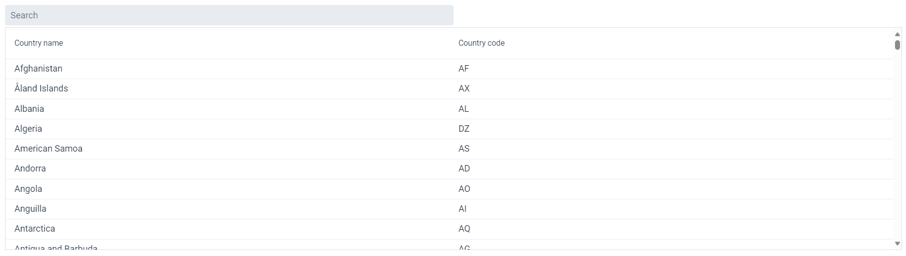
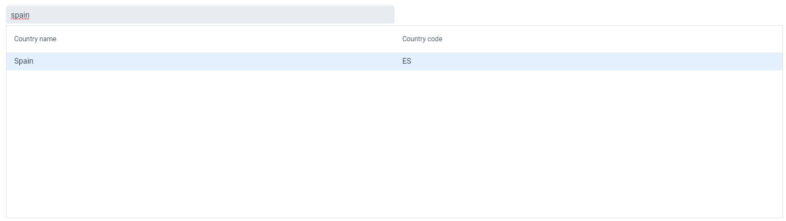
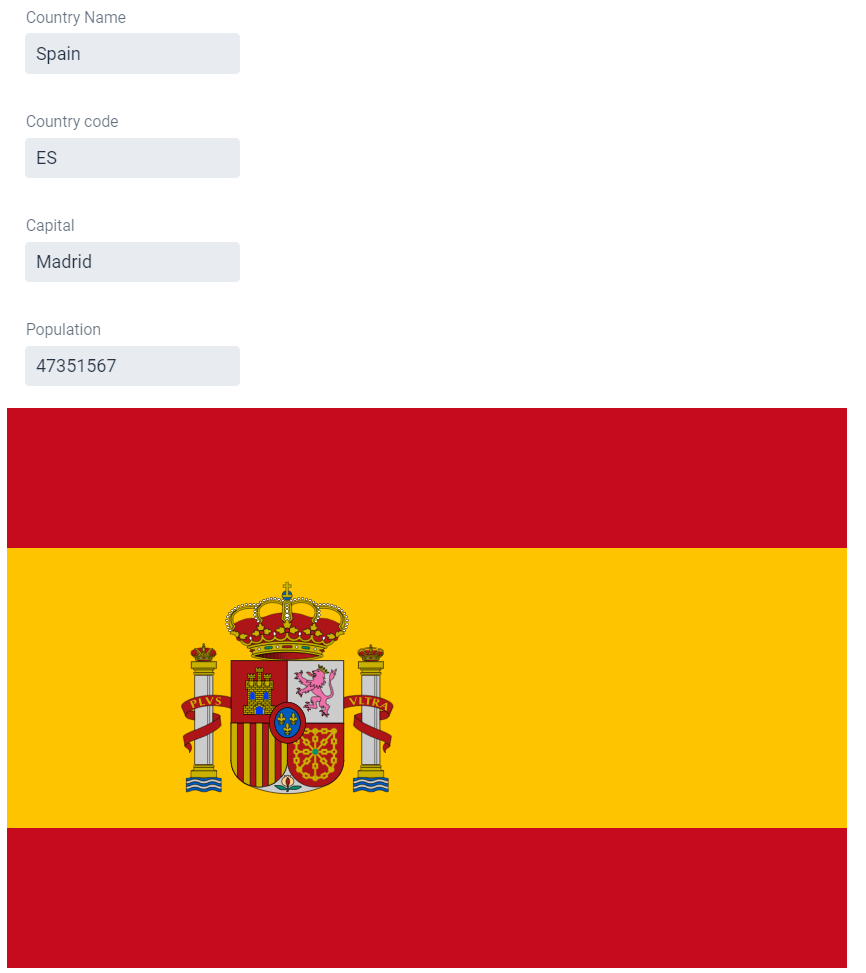

# Coding exercise - COUNTRY SERVICE (with Vaadin and Spring Boot)

This example application implements a microservice which provides a list of countries and, in addition, provides more detailed information per country.

It includes both the rest API and web application in the same project.

The web application looks like this:

## Running the Application

Import the project to the IDE of your choosing as a Maven project.

Run the application using `mvn spring-boot:run` or by running the `Application` class directly from your IDE.

Open http://localhost:8080/ in your browser.

If you want to run the application locally in the production mode, run `mvn spring-boot:run -Pproduction`.

## More Information about Vaadin

- [Vaadin documentation](https://vaadin.com/docs)
- [Using Vaadin and Spring](https://vaadin.com/docs/v14/flow/spring/tutorial-spring-basic.html) article

